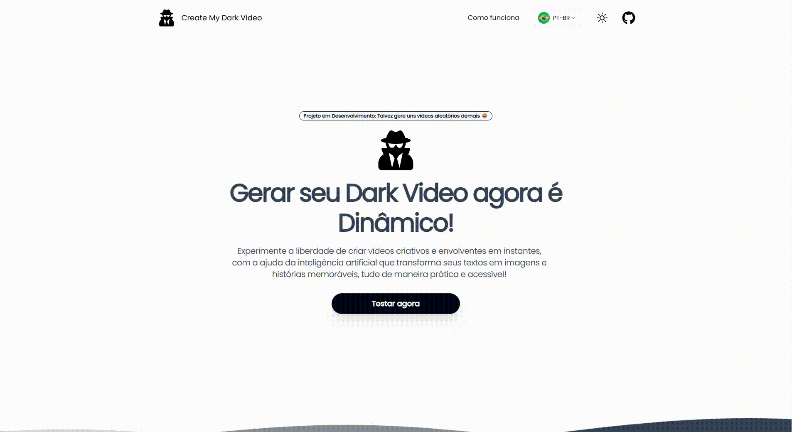

# Create My Dark Video ~ Front-End

Imagine criar vídeos a partir de uma única descrição, é isso que o **Create My Dark Video** oferece. 

Com tecnologias de IA para geração de imagens e áudios, este projeto transforma prompts escritos pelos usuários em vídeos personalizadas de maneira simples e intuitiva.

<div style="display: flex; gap: 15px">

</div>

<br>

Projeto Demo: https://create-my-dark-video.vercel.app

## Tecnologias
- [Nuxt](https://nuxt.com/)
- [Shadcn Ui](https://www.shadcn-vue.com/)
- [Tailwind CSS](https://tailwindcss.com/)

## Setup
```bash
# Instale as dependências
npm install

# Inicialize o server em http://localhost:3000
npm run dev
```

## Licença
- [MIT](./LICENSE)